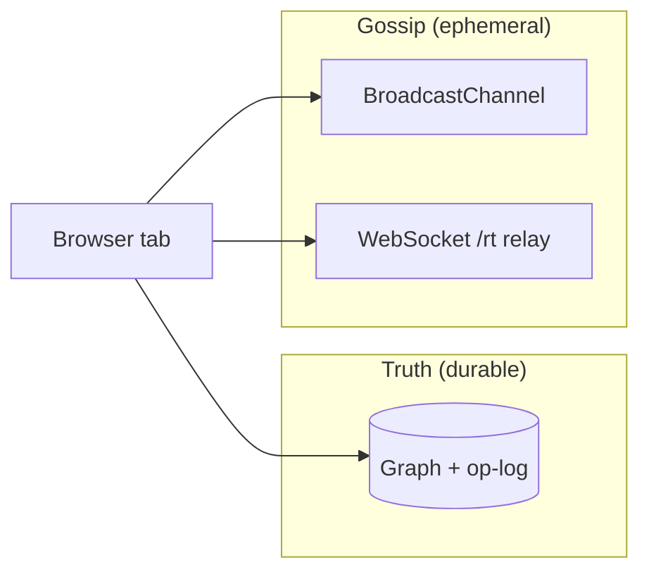

# You are not alone in here

*Draft for brew.build: on building realtime presence for a local-first graph.*

**Try it:** open [playground.trellis.computer/projections/posts?room=realtime-app](https://playground.trellis.computer/projections/posts?room=realtime-app) in two tabs (or two browsers) with the same `?room=` slug.

---

The loneliest feeling in software is editing something you *know* someone else is in, and seeing nothing. No cursor, no name, no sign of life — just your own changes and a vague anxiety about clobbering theirs. Google Docs fixed this so thoroughly we forgot it was a problem: colored carets, avatars in the corner, the flash of someone's selection. That ambient awareness is most of what makes collaboration feel safe.

Local-first apps make the problem stranger. When no server owns the truth, "who else is here?" isn't a database query. It's something you have to *spread* — the way people spread it in a house full of rooms. Not everything that travels between people should end up in the minutes.

> **The graph is truth. Presence is gossip.**

Truth is what you'd put in the record: the post, the chat message, the cell value after you hit save. Gossip is what you'd say passing in the hall: *they're on the porch*, *I think they're editing the budget row*, *haven't seen them since they tabbed away*. Useful. Social. Not the same thing as fact, and it shouldn't be.

Conflating the two is how realtime features rot.

## What we were actually building

We weren't aiming for multiplayer theater. The reference point was **[ambient co-presence](https://maggieappleton.com/ambient-copresence)** — Maggie Appleton's pattern for sharing a space without demanding attention. A cafe, not a stage. You sense other people reading, typing, drifting. Peripheral awareness, not a spotlight in your face.

That shaped every tradeoff. Presence should be a fuzzy hint of gesture, not pixel-perfect truth. It should be tactful: away-dim when someone tabs out, cursors that hide at the window edge, carets that expire instead of haunting the screen. We're not building Gather Town. We're building the digital equivalent of reading on the same porch.

## Truth and gossip, as systems

Trellis stores durable facts in an EAV graph with a content-addressed op-log — the kind of thing you can sync peer-to-peer and replay. That's **truth**. It earns durability.

**Gossip** is everything else about being in the room together: where your cursor is, which page you're on, which cell has your focus, whether you're away. High-frequency, disposable, meaningless five seconds later. If a cursor position survived a refresh, that would be a bug — like finding "Alex was hovering near the submit button at 2:47pm" etched into a contract.

So they ride **separate pipes**. Edits that must survive refresh go through the graph. Cursor position, route, away state go through an ephemeral pub/sub room you join and leave. The graph and the cursor never share a wire. I can rewrite the entire presence layer without risking a single fact in the graph.

**Rule:** refresh must not resurrect gossip. Gossip can fail loudly and harmlessly; truth keeps working.

## Names without accounts

Before you can show someone, you have to name them. The playground is a sandbox — no logins, no accounts. Demanding identity to see a cursor would kill the feeling.

So each tab gets minted a name like **Swift Otter** or **Jolly Lynx** and a color from a fixed palette. It lives in `sessionStorage`, not `localStorage`, on purpose: `localStorage` is shared across tabs, which would make two tabs look like *one* person. Per-tab storage means opening a second tab gives you a second collaborator to wave at — the fastest way to see the whole system work solo.

No PII. Nothing to moderate. The name is just text.

## The gossip people actually spread

A presence payload is small: name, color, viewport coordinates, optional cell focus and caret position, optional route, optional away flag. No entity IDs required. Just enough signal for ambient awareness — the digital equivalent of glancing up and seeing someone at the other end of the table.

**Cursors, everywhere.** We started with cursors only over the board (table, kanban). It felt broken. A cursor that vanishes when someone's mouse drifts over the sidebar isn't presence; it's a peephole. Tracking moved to the window: pointer sampled at ~30fps, rendered in a fixed overlay above the whole app. You see each other hovering buttons, reading the sidebar, drifting across empty space.

We send pixel coordinates, not normalized fractions. Presence is about *gesture*, not CAD precision. When your pointer leaves the window, an offscreen sentinel hides your cursor so peers don't see a ghost frozen at the edge. When you focus a cell to type, the pointer yields to the text caret — showing both would be visual noise. Presence is as much about what you hide as what you show.

**Where is everyone?** Cursors answer who's on *this page*. In a multi-page app, the more interesting question is *which page*. So each session runs **two gossip channels**:

1. A **page-scoped room** (keyed by pathname): cursors, cell focus, carets — fine-grained stuff for people sharing your exact view.
2. A **session-wide lobby** (`__nav__`): everyone continuously broadcasts which route they're on.

The lobby powers navigational presence: tiny avatars on the icon rail, on sidebar items, in breadcrumbs. Click into a collection and your avatar follows you there. The chrome becomes a live map of who's reading what — gossip about *location*, not about *content*.

Matching is forgiving: a nav link lights up when a peer's path matches and the link's query params are a subset of theirs, so opening a side panel doesn't make you "disappear" from the collection you're obviously still in. Layered on top: header avatar stacks, join/leave toasts, away-dim when someone tabs out. None of it is load-bearing. All of it answers *am I alone?* without you having to ask.

**Editing in the same cell.** The deepest layer is co-editing. Focus a cell and peers see a focus ring; type and they see a live caret with a timestamp so stale carets expire on their own. This is the part that feels like Docs — and it's the part most sensitive to the split: the *text* becomes graph truth; the *caret* stays gossip.

## How gossip travels (and when it doesn't need a server)

Gossip degrades in tiers, mirroring Trellis's core stance: the cloud can relay, but never own state.

| Tier | Transport | When |
|------|-----------|------|
| 1 | `BroadcastChannel` | Same browser — two tabs, iframe + parent |
| 2 | WebSocket `/rt` | Cross-browser / cross-machine on hosted room |
| 3 | (none) | Solo — presence UI hidden, graph still works |

Same browser, no server: two tabs see each other with zero network. Across browsers, an optional relay fans gossip out; the client probes relay health on join and falls back to BroadcastChannel if it's down.

The relay is an **accelerant, never an authority**. It moves gossip faster between browsers; it doesn't own anything. If the relay vanishes, you lose cross-browser cursors and lose nothing else. The graph was never on that wire.

(One subtlety: the same person can arrive over both BroadcastChannel and the relay, so peers are de-duplicated by stable id before rendering. Otherwise you'd wave at the same Otter twice.)

## What counts as truth in the social surfaces

Presence answers *who's here and where*. **Posts** and **group chat** answer *what we said* — and those live in the graph.

| Surface | Route | Pipe |
|---------|-------|------|
| Posts feed | `/projections/posts` | `CollectionRecord` entities |
| Group chat | `/projections/chat` | `message` entities scoped by `?room=` |
| Likes / comments | on Posts | `post-like` / `post-comment` entities |

Chat history and posts survive refresh. Cursor position shouldn't. That split is intentional.

Agents writing to the same graph via MCP are on the truth pipe too — they don't need animated cursors; they need durable facts.

## What I'd tell anyone building this

1. Decide what's **truth** and what's **gossip** on day one — the interpersonal version, not just the architectural one.
2. Give them **separate pipes**; let gossip fail without touching facts.
3. Aim for **ambient co-presence**, not multiplayer theater.
4. Everything else — cursors, carets, avatars, the little map of who's reading what — is detail you can add once the line is clean.

Presence is a forcing function for that line. Every time I was tempted to "just stash the cursor in the entity," the separation pushed back and the system got simpler. The features that landed best were the quiet ones.

## Try it

| Experience | URL |
|------------|-----|
| Full playground | [playground.trellis.computer/projections/posts?room=realtime-app](https://playground.trellis.computer/projections/posts?room=realtime-app) |
| Kanban + cursors | […/projections/kanban?room=realtime-app](https://playground.trellis.computer/projections/kanban?room=realtime-app) |
| Group chat | […/projections/chat?room=realtime-app](https://playground.trellis.computer/projections/chat?room=realtime-app) |
| Embed gallery | [playground.trellis.computer/fractals/embeds](https://playground.trellis.computer/fractals/embeds) |

*Trellis is a local-first semantic graph OS. The presence layer above ships in the playground demo.*

---

## References

- [Ambient Co-presence](https://maggieappleton.com/ambient-copresence), Maggie Appleton (2023)
- [Cursor Party](https://blog.partykit.io/posts/cursor-party), PartyKit
- [Designing multiplayer apps with patterns from architecture](https://interconnected.org/home/2023/05/10/multiplayer), Matt Webb
- Internal: [fractals-blog-embeds.md](./fractals-blog-embeds.md) · [presence-overlay-activity.md](./presence-overlay-activity.md)

---

## Publish checklist (ops)

- [ ] GIF: two tabs, cursors on kanban + sidebar
- [ ] Recording: nav badges as peer switches routes
- [ ] Recording: cell co-editing with live carets
- [ ] Embeds from [embed gallery](https://playground.trellis.computer/fractals/embeds)
- [ ] Security pass: [security-review-public-room.md](./security-review-public-room.md)
