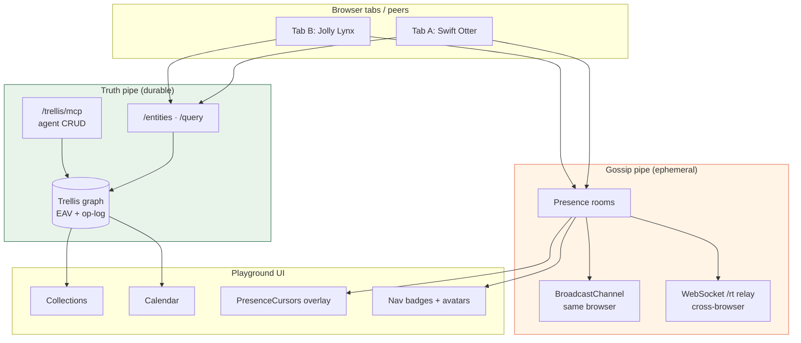
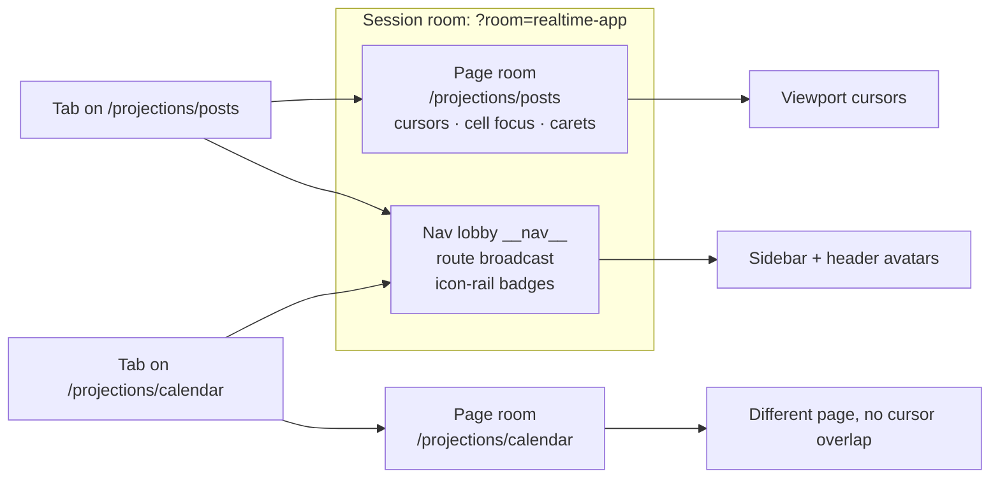
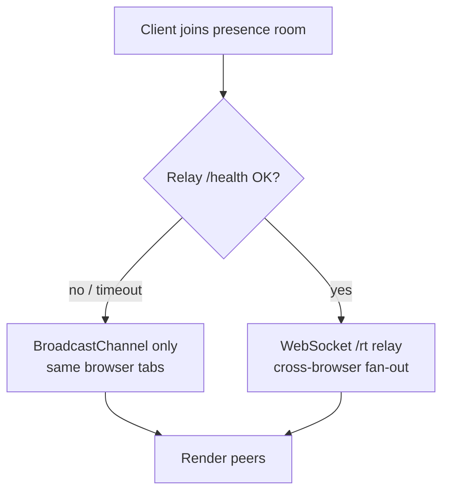
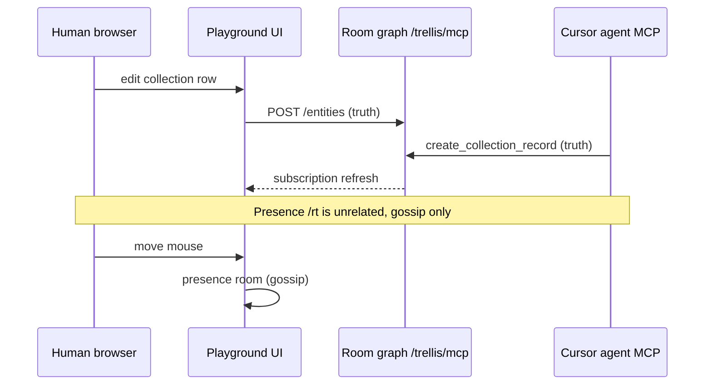

# You are not alone in here

*Draft for brew.build: on building realtime presence for a local-first graph.*

**Live demo:** open [playground.trellis.computer/projections/posts?room=realtime-app](https://playground.trellis.computer/projections/posts?room=realtime-app) in two tabs (or two browsers) with the same `?room=` slug.

---

The loneliest feeling in software is editing a document you *know* someone else is in, and seeing nothing. No cursor, no name, no sign of life: just your own changes and a vague anxiety about whether you're about to clobber theirs. Google Docs solved this so completely that we stopped noticing it: the little colored carets, the avatars in the corner, the flash of someone's selection. That ambient awareness is most of what makes collaboration feel safe.

Local-first apps have a harder version of this problem. When there's no always-on server that owns the truth, "who else is here?" isn't a database query; it's gossip you have to spread yourself. This is the story of building that gossip layer for the Trellis playground, and the line I kept coming back to:

> **The graph is truth. Presence is gossip.**

Those are two different systems with two different jobs, and conflating them is how realtime features rot.

## Inspiration: ambient co-presence

Most of what we wanted wasn't "multiplayer mode." It was **[ambient co-presence](https://maggieappleton.com/ambient-copresence)**, Maggie Appleton's pattern for *sharing a space without demanding attention*.

In a cafe you sense other people reading, typing, drifting: peripheral awareness, not a spotlight. Google Docs cursors are the opposite end of the spectrum: precise, animated, attention-grabbing. Appleton's write-up asks for something softer: a **fuzzy hint of presence** that scales past a handful of peers, more heatmap than laser pointer.

That framing shaped our tradeoffs:

| Docs-style cursors | Ambient co-presence (our target) |
|--------------------|----------------------------------|
| Exact selection / focus | Normalized gesture, not pixel truth |
| Demands attention | Peripheral: avatars, away-dim, quiet toasts |
| One shared document | Multi-page app: *where* matters as much as *where pointing* |
| Server-owned session | Gossip pipe that can fail without touching facts |

We're not building Gather Town. We're building the digital equivalent of reading on the same porch. You know someone's there, you don't need a meeting about it.

**Further reading:** [Ambient Co-presence](https://maggieappleton.com/ambient-copresence) (Maggie Appleton, 2023) · [Cursor Party](https://blog.partykit.io/posts/cursor-party) (PartyKit: the one-liner multiplayer cursor) · [Designing multiplayer apps with patterns from architecture](https://interconnected.org/home/2023/05/10/multiplayer) (Matt Webb)

---

## Architecture at a glance



**Rule:** edits that must survive refresh → graph. Cursor position, route, away state → presence only. Never the op-log.

### Two presence rooms per session



---

## Truth vs. gossip

Trellis stores everything as an EAV graph with a content-addressed op-log: durable, ordered, the kind of thing you can sync peer-to-peer and replay. That's *truth*. It earns durability.

Presence is the opposite. Where your cursor is, which cell you're editing, whether you tabbed away to Slack. None of that should ever touch the op-log. It's high-frequency, disposable, and meaningless five seconds later. If a cursor position survived a refresh, that would be a bug.

So presence rides a separate channel entirely. The graph and the cursor never share a pipe. Concretely: the durable graph goes over Trellis's entity transport; presence goes over an ephemeral pub/sub room you join and leave. They don't know about each other, and that's the point. I can rewrite the entire presence layer without risking a single fact in the graph.

### The presence payload (gossip schema)

```ts
// lib/presence/types.ts
export const OFFSCREEN = -1;

export interface BoardPresence {
  name: string;
  color: string;
  x: number;          // viewport clientX (px); OFFSCREEN when hidden
  y: number;          // viewport clientY (px)
  cardId?: string | null;
  cellRowId?: string | null;
  cellKey?: string | null;
  caret?: number | null;
  caretAt?: number | null;  // stale carets expire
  route?: string | null;    // nav lobby only
  away?: boolean | null;    // Page Visibility API
}
```

No entity IDs required. No accounts. Just enough signal for ambient awareness.

---

## Identity without accounts

Before you can show someone, you have to name them. But the playground is a sandbox. There are no accounts, and demanding a login to see a cursor would defeat the entire feeling.

So identity is anonymous and automatic, Google-Docs-style: on first load you're minted a name like **Swift Otter** or **Jolly Lynx** and a color from a fixed palette, seeded from a random id.

```ts
// lib/presence/identity.ts: per-tab, not per-browser
const IDENTITY_KEY = 'trellis-playground-presence-identity';
// sessionStorage: localStorage would make two tabs look like ONE person
```

It lives in `sessionStorage`, not `localStorage`, deliberately. `localStorage` is shared across tabs, which would make two tabs look like *one* person; `sessionStorage` is per-tab, so opening a second tab gives you a second collaborator to wave at. (Try it: it's the fastest way to see the whole system work solo.)

No PII, nothing to moderate, nothing to escape when we render it. The name is just text and the color is just an inline style.

<!-- MEDIA: screen recording: open playground twice, show two different animal names in header avatars -->

---

## Cursors, everywhere

The first thing people want is the cursor. We started with cursors that only appeared *over the board* (the table, the kanban) because that's where the collaborative editing was. It felt broken. A cursor that vanishes the moment someone's mouse drifts over the sidebar isn't presence; it's a peephole.

So we moved tracking up to the window. The local pointer is sampled as literal viewport coordinates (`clientX` / `clientY`), throttled to ~30 fps, and streamed to the room.

```ts
// lib/presence/use-pointer-presence.ts
const THROTTLE_MS = 33; // ~30 fps

const onPointerMove = (event: PointerEvent) => {
  const coords = resolvePointerPresence(event.clientX, event.clientY);
  schedule(coords); // throttled push to presence room
};
```

Every peer renders incoming cursors in a single fixed overlay above the whole app:

```tsx
// components/presence/presence-cursors.tsx
const position = viewportToFixed(x, y);

<div
  className="pointer-events-none fixed z-50"
  style={{
    left: position.left,
    top: position.top,
    color: peer.state.color,
  }}
>
  <PresencePointer />
  <span style={{ backgroundColor: peer.state.color }}>{name}</span>
</div>
```

The result: you see each other *everywhere*: hovering a button, reading the sidebar, drifting across empty space, not just inside one widget.

We send **pixel coordinates**, not normalized fractions. That keeps the implementation simple: what you stream is where the pointer renders on peers sharing a similar viewport layout. It's not pixel-perfect across wildly different window sizes, and it doesn't need to be. Presence is about *gesture*, not CAD precision. (Appleton's "softer, fuzzier hint": we kept the pointer shape but dropped board-bounded clipping.)

A couple of small decisions that mattered more than expected:

- An `OFFSCREEN` sentinel hides your cursor when your pointer leaves the window, so peers don't see a ghost frozen at the last edge.
- When you focus a cell to type, your *pointer* cursor yields to your *text* caret. Showing both would be visual noise. Presence is as much about what you hide as what you show.

### Interactive embed: cursors (same browser)

Open the same URL in **two tabs** to see BroadcastChannel presence (no server required).

```html
<!-- brew.build iframe: kanban demo room -->
<div style="position:relative;width:100%;aspect-ratio:1/1;overflow:hidden;border-radius:8px;border:1px solid #333;">
  <iframe
    src="https://playground.trellis.computer/projections/kanban?embed=1&room=realtime-app"
    title="Trellis Playground: kanban with presence"
    style="position:absolute;inset:0;width:100%;height:100%;border:0;"
    loading="lazy"
    allow="clipboard-write"
  ></iframe>
</div>
<p><em>Caption:</em> Open this URL in a second tab to see cursors. Cross-browser needs the <code>/rt</code> relay on the hosted room.</p>
```

Gallery of copy-paste snippets: [playground.trellis.computer/fractals/embeds](https://playground.trellis.computer/fractals/embeds)

<!-- MEDIA: GIF: two cursors crossing on kanban + sidebar -->
<!-- MEDIA: screen recording: OFFSCREEN when pointer leaves window -->

---

## Where is everyone?

Cursors tell you who's on *this* page. The more interesting question in a multi-page app is *which page is everyone on?*

That needs a second, wider channel. The playground runs two presence rooms at once:

```ts
// lib/presence/config.ts
export function scopedPresenceRoom(sessionRoom: string, pathname: string): string {
  return presenceRoomId(presenceRouteKey(pathname), sessionRoom);
  // e.g. "/projections/posts:realtime-app"
}

export function navPresenceRoom(sessionRoom: string): string {
  return presenceRoomId('__nav__', sessionRoom);
  // session-wide lobby for route badges
}
```

1. A **page-scoped** room (keyed by pathname): cursors and cell edits; fine-grained stuff only for people sharing your exact view.
2. A **session-wide** room (`__nav__` lobby): every peer continuously broadcasts which route they're on.

```ts
// Join + dedupe (BroadcastChannel + relay can both deliver the same peer)
joined = joinPresence<BoardPresence>({
  peerId: opts.peerId,
  room: opts.roomName,
  relayUrl, // optional, probed at join
  initialPresence: snapshot(),
});
joined.presenceSignal.subscribe((peers) => {
  setPresence(dedupePresencePeers(peers));
});
```

That second channel powers *navigational* presence. Tiny avatars appear:

- on the icon rail, showing who's in each mode,
- on sidebar collection and type items, showing who's reading what,
- inside breadcrumb links.

```tsx
// components/presence/presence-avatars.tsx: session lobby peers
<AvatarFallback
  style={peer.state.away ? undefined : { backgroundColor: peer.state.color }}
>
  {initialsForName(peer.state.name)}
</AvatarFallback>
```

Click into a collection and your little avatar follows you there, surfacing on the sidebar item for everyone still on the index. It turns the navigation chrome into a live map of the team: ambient co-presence applied to *navigation*, not just document surface.

The matching is deliberately forgiving. A link lights up when a peer's *path* matches and the link's own query params are a subset of theirs, so opening a side panel (`?record=…`) doesn't make you "disappear" from the collection you're obviously still in.

Layered on top are the ambient signals you'd expect: a stack of avatars in the header, a toast when someone joins or leaves, and an "away" dimming when a peer tabs out. None of it is load-bearing; all of it answers *am I alone?* without you having to ask.

<!-- MEDIA: screen recording: click from Collections → Calendar, watch nav badges update -->
<!-- MEDIA: still: sidebar with 2–3 PresenceLinkBadge dots on collection items -->

### Interactive embed: collections + nav badges

```html
<div style="position:relative;width:100%;aspect-ratio:1/1;overflow:hidden;border-radius:8px;border:1px solid #333;">
  <iframe
    src="https://playground.trellis.computer/?embed=1&room=realtime-app"
    title="Trellis Playground: collections with nav presence"
    style="position:absolute;inset:0;width:100%;height:100%;border:0;"
    loading="lazy"
  ></iframe>
</div>
```

---

## Editing in the same cell

The deepest layer is co-editing. In the table, focusing a cell broadcasts a focus ring others can see, and typing streams a live caret, with the caret's character offset and a timestamp, so a stale caret expires on its own instead of lingering forever if a frame gets dropped.

```ts
// When cell focused: hide viewport pointer, show caret gossip
pushPresence({
  x: OFFSCREEN,
  y: OFFSCREEN,
  cellRowId: row.id,
  cellKey: column.key,
  caret: selectionStart,
  caretAt: Date.now(),
});
```

Two people in the same cell see each other's carets move in real time. This is the part that feels like Docs, and it's also the part most sensitive to the truth/gossip split: the *text* edits become graph facts; the *caret* never does.

<!-- MEDIA: split-screen recording: two tabs, same table cell, carets moving -->
<!-- TODO embed: table projection iframe when stable demo room seeded -->

---

## No server required (but one helps)

Here's the local-first part. The presence layer degrades in tiers:



| Tier | Transport | When |
|------|-----------|------|
| 1 | `BroadcastChannel` | Same browser: two tabs, iframe + parent |
| 2 | WebSocket `/rt` | Cross-browser / cross-machine on hosted room |
| 3 | (none) | Solo: presence UI hidden, graph still works |

- **Same browser, no server:** presence rides a `BroadcastChannel`. Two tabs see each other with zero network. This is how the blog's single-iframe demos still show cursors: open the same URL twice.
- **Across browsers / machines:** an optional WebSocket relay (`/rt`) fans presence out. The client probes the relay's health on join and *falls back to BroadcastChannel if it's down*.

```ts
// lib/presence/config.ts: hosted Playground
export function resolvePresenceRelayUrl(): string | undefined {
  const trellis = process.env.NEXT_PUBLIC_TRELLIS_URL?.trim();
  if (!trellis) return undefined;
  return `${trellis.replace(/^http/i, 'ws').replace(/\/$/, '')}/rt`;
}
```

Local dev with cross-browser testing:

```bash
# fractal-playground/
just presence-relay   # optional WS relay on :8231
```

The relay is an **accelerant, never an authority**. It moves gossip faster between browsers; it doesn't own anything. This mirrors the core Trellis stance: the cloud can relay and backup, but it never owns state, applied to the smallest, most disposable data we have. If the relay vanishes, you lose cross-browser cursors and lose nothing else. The graph was never on that wire.

(One subtlety from running two transports: the same person can arrive over both BroadcastChannel and the relay, so peers are de-duplicated by their stable id before rendering. Otherwise you'd wave at the same Otter twice.)

```ts
// lib/presence/dedupe-peers.ts
export function dedupePresencePeers(peers) {
  // prefer `self` entry when duplicate ids from BC + relay
}
```

<!-- MEDIA: screen recording: same machine, Chrome + Firefox, cursors via /rt relay -->

---

## Agents in the room (separate pipe)

Cursor agents can write to the **same graph** via MCP (collections, calendar events, notes) but that traffic never touches the presence layer. Another reason to keep pipes separate: an agent doesn't need a animated cursor; it needs durable facts.



Blog readers who want to try agent writes: see `trellis-node/docs/planning/remote-mcp-gateway.md` *(MCP setup: demo room + optional local graph; companion post TBD)*.

---

## Social surfaces (truth, not gossip)

Presence answers *who's here and where*. **Posts** and **group chat** answer *what we said* — and those live in the graph (durable), while cursors stay gossip.

| Surface | Route | Pipe |
|---------|-------|------|
| Posts (twitter-style feed) | `/projections/posts` | `CollectionRecord` entities |
| Group chat | `/projections/chat` | `message` entities scoped by `?room=` |
| Likes / comments | on Posts | `post-like` / `post-comment` entities |

That split is intentional: chat history and posts survive refresh; cursor position shouldn't. First visit to the full playground (non-embed) shows a short welcome explaining the room is world-writable and may reset.

---

## What presence taught me

Presence is a forcing function for a clean architecture. Every time I was tempted to "just stash the cursor in the entity," the separation pushed back and the system got simpler. The features that landed best were the *quiet* ones: the away-dim, the caret that expires itself, the cursor that politely hides at the screen edge. Presence done well is mostly tact, the word Appleton uses implicitly when she contrasts "fuzzy" presence with attention-heavy multiplayer.

The thing I'd tell anyone building this into a local-first app:

1. Decide what's **truth** and what's **gossip** on day one.
2. Give them **separate pipes**; let gossip fail loudly and harmlessly.
3. Aim for **ambient co-presence**, not multiplayer theater.
4. Everything else (cursors, carets, avatars, the little map of who's reading what) is detail you can add once the line is clean.

---

## Try it

| Experience | URL |
|------------|-----|
| Full playground (Social home) | [playground.trellis.computer/projections/posts?room=realtime-app](https://playground.trellis.computer/projections/posts?room=realtime-app) |
| Posts feed | […/projections/posts?room=realtime-app](https://playground.trellis.computer/projections/posts?room=realtime-app) |
| Group chat | […/projections/chat?room=realtime-app](https://playground.trellis.computer/projections/chat?room=realtime-app) |
| Kanban + cursors | […/projections/kanban?room=realtime-app](https://playground.trellis.computer/projections/kanban?room=realtime-app) |
| Embed gallery | [playground.trellis.computer/fractals/embeds](https://playground.trellis.computer/fractals/embeds) |

*Trellis is a local-first semantic graph OS. The presence layer above ships in the playground demo.*

---

## References

- [Ambient Co-presence](https://maggieappleton.com/ambient-copresence), Maggie Appleton (2023). Primary UX inspiration: peripheral shared space without demanding attention.
- [Cursor Party](https://blog.partykit.io/posts/cursor-party), PartyKit. One-line multiplayer cursors on any page.
- [Designing multiplayer apps with patterns from architecture](https://interconnected.org/home/2023/05/10/multiplayer), Matt Webb.
- [Ambient Intimacy](https://leisa.info/ambient-intimacy/), Leisa Reichelt (2007). Older framing; still useful for "quiet signals."
- Internal: [fractals-blog-embeds.md](./fractals-blog-embeds.md) · [presence-overlay-activity.md](./presence-overlay-activity.md) (overlay chips, next iteration)

---

## Publish checklist

### Media to capture

- [ ] **GIF**: two tabs, cursors crossing kanban + sidebar (`?room=realtime-app`)
- [ ] **Recording**: nav badges update as peer switches Posts → Kanban
- [ ] **Recording**: cell co-editing with live carets (table projection)
- [ ] **Recording**: cross-browser cursors via `/rt` (Chrome + Firefox)
- [ ] **Still**: header `PresenceAvatars` stack with away-dim
- [ ] **Screenshot**: Posts feed + group chat with two peers in room

### Embeds to ship

- [ ] Kanban iframe `?embed=1&room=realtime-app` (cursors; caption: open second tab)
- [ ] Collections iframe `?embed=1&room=realtime-app` (nav badges)
- [ ] Optional: entity/collection fractal embeds from [embed gallery](https://playground.trellis.computer/fractals/embeds)

### Ops / security (before wide `?room=` link)

- [ ] Confirm relay live on sprites node: see [fractals-blog-embeds.md](./fractals-blog-embeds.md#after-deploy)
- [ ] Security pass: [security-review-public-room.md](./security-review-public-room.md)
- [ ] MCP demo room section reviewed if linking agent CRUD
